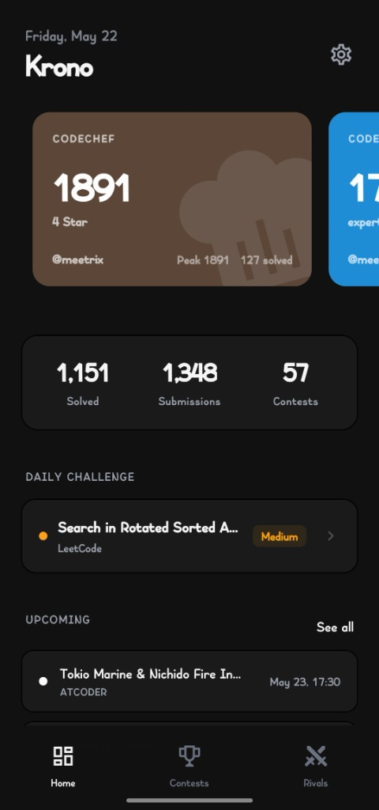
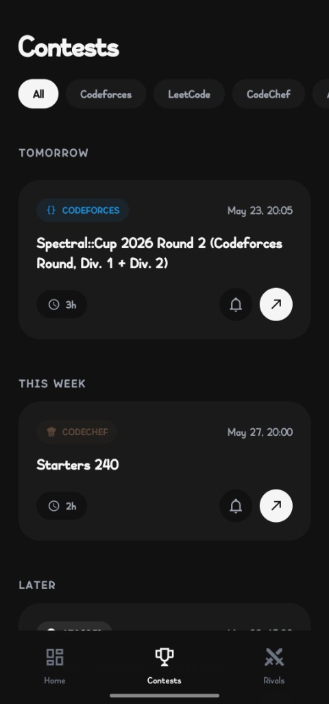
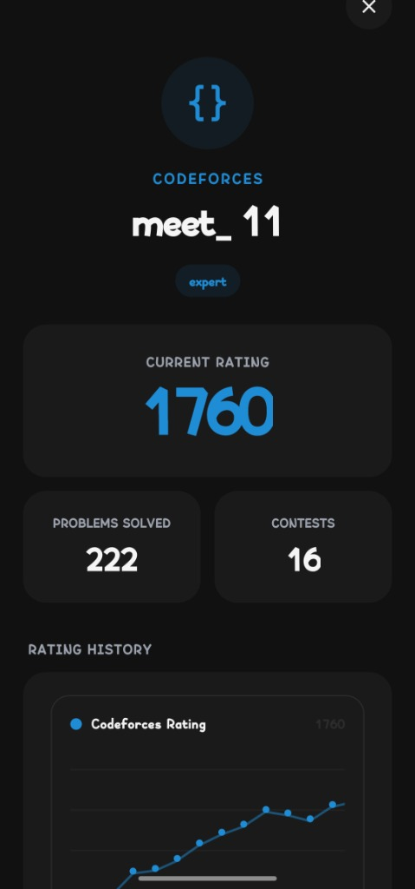
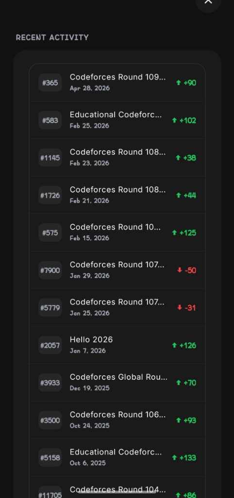

# Krono

A sleek, modern mobile app for competitive programmers — track contests, sync profiles, and monitor your rating across **Codeforces**, **LeetCode**, **AtCoder**, and **CodeChef**.

Built with **React Native (Expo)** and **Material Design 3** using a clean, minimal design system.

---

## Screenshots

<p align="center">
  
  
  
  
</p>

---

## Features

- **Multi-Platform Contests** — Live, upcoming, and past contests from Codeforces, LeetCode, AtCoder, and CodeChef in one unified view.
- **Rivals & Leaderboards (New!)** — Add competitive programming rivals and track ratings side-by-side on an automatically-sorted leaderboard per platform.
- **Profile Sync** — Connect your handles to see live ratings, global ranks, and solved problem counts.
- **Total Stats** — View your combined stats across all platforms (total problems solved, submissions, and contests participated) in a central stats dashboard.
- **Rating Graphs** — Interactive rating history charts for every platform powered by native API endpoints.
- **Contest History** — Browse your recent contest performances with rank achievements and rating differentials.
- **Smart Reminders** — Schedule background fetch notifications so you never miss a round.
- **Minimal Premium Aesthetics** — Beautiful, high-contrast UI featuring distraction-free solid platform colors, elegant elevated surface cards, and full light/dark mode support.

---

## Tech Stack

| Layer      | Technology                                                  |
| ---------- | ----------------------------------------------------------- |
| Framework  | React Native + Expo SDK 54                                  |
| UI         | React Native Paper (Material Design 3)                      |
| State      | Zustand                                                     |
| Navigation | Expo Router                                                 |
| APIs       | Codeforces API, LeetCode GraphQL, AtCoder JSON, CodeChef Scraper |
| Storage    | SQLite + AsyncStorage                                       |

---

## Getting Started

### Prerequisites

- Node.js v18+
- npm or yarn
- Android Emulator / iOS Simulator / Expo Go on a physical device

### Setup

```bash
# Clone
git clone https://github.com/MeetThakur/Krono.git
cd Krono

# Install dependencies
npm install

# Configure environment variables (optional — only needed for upcoming contests)
cp .env.example .env
# Edit .env and add your Clist.by API key

# Start development server
npm start
```

Press `a` for Android, `i` for iOS, or scan the QR code with Expo Go.

### Local APK Build (arm64-v8a)

Requires **Android Studio** to be installed.

#### Automated Script (Windows Powershell)
You can run the bundled helper script to automatically find your Android Studio JDK and build the release APK:

```powershell
# 1. Generate the native Android directory
npx expo prebuild --platform android

# 2. Run the local build script
.\local_build.ps1
```

#### Manual Build Steps
Alternatively, you can build the APK manually:

```powershell
# Generate native Android project
npx expo prebuild --platform android

# Set local JDK environment and build release APK for arm64-v8a
cd android
$env:JAVA_HOME = "C:\Program Files\Android\Android Studio\jbr"
$env:Path = "$env:JAVA_HOME\bin;" + $env:Path
.\gradlew.bat assembleRelease "-PreactNativeArchitectures=arm64-v8a" "-Dorg.gradle.java.home=C:\Program Files\Android\Android Studio\jbr"
```

> **Troubleshooting: SDK Location Not Found**
> Running `npx expo prebuild` may wipe your local properties file. If the build fails with `SDK location not found`, create a file at `android/local.properties` and add:
> `sdk.dir=C:\\Users\\meet1\\AppData\\Local\\Android\\Sdk` (replacing with your actual Android SDK path).

Output APK: `android/app/build/outputs/apk/release/app-release.apk`

### Environment Variables

| Variable                     | Description                               |
| ---------------------------- | ----------------------------------------- |
| `EXPO_PUBLIC_CLIST_API_KEY`  | Your [Clist.by](https://clist.by) API key *(optional)* |
| `EXPO_PUBLIC_CLIST_USERNAME` | Your Clist.by username *(optional)*       |

> **Note:** Clist.by is only required for the upcoming contests feed. Profile stats (ratings, contest history, and charts) are fetched natively from each platform's official API.

Get your API key at [clist.by/api/v4/doc](https://clist.by/api/v4/doc/).

---

## Configuration

Customize via the in-app **Settings** screen:

- Toggle Dark / Light mode (system sync or manual toggle)
- Enable background sync
- Manage notification timing
- Add / remove connected platform profiles

---

Made with ❤️ by Meet
