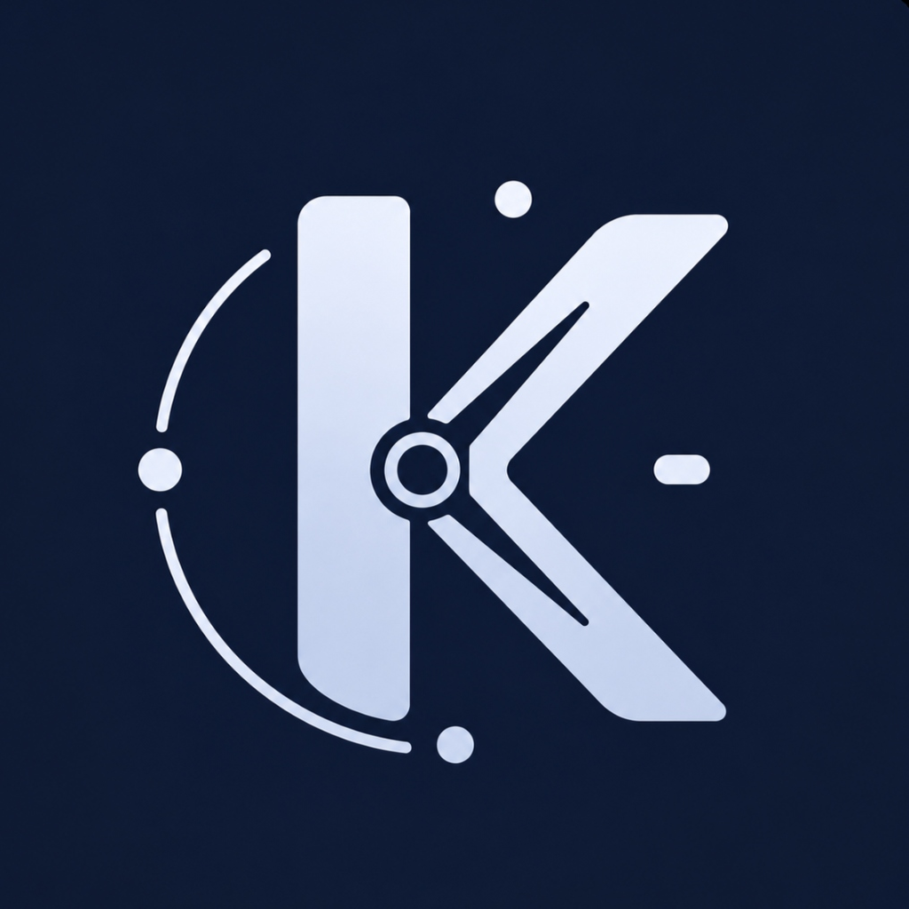

<p align="center">
  
</p>

<h1 align="center">Krono</h1>

<p align="center">
  <strong>The ultimate competitive programming companion.</strong><br />
  Track contests, sync profiles, compare ratings with rivals, and analyze performance across platforms in real-time.
</p>

<p align="center">
  
  
  
  
  
  
</p>

---

## 📱 Screenshots

<p align="center">
  
  
  
  
</p>

---

## ✨ Features

- **📅 Consolidated Contest Schedule** — Live, upcoming, and past contests from Codeforces, LeetCode, AtCoder, and CodeChef in one unified, timezone-adjusted view.
- **⚔️ Rivals & Leaderboards (v1.4.0)** — Add competitive programming rivals and track ratings side-by-side on an automatically-sorted leaderboard per platform.
- **🔄 Profile Integration & Sync** — Connect multiple competitive programming accounts to automatically pull live ratings, global ranks, and solved problem counts.
- **📈 Detailed Performance Insights** — View comprehensive stats, interactive rating charts, and complete history of your past contests.
- **🔔 Smart Background Reminders** — Schedule background fetch notifications so you never miss a round.
- **🎨 Premium Minimalist Aesthetics** — Beautiful, high-contrast UI featuring distraction-free solid platform colors, elegant elevated surface cards, and full light/dark mode support.

---

## 🛠️ Tech Stack

| Layer | Technology | Description |
| :--- | :--- | :--- |
| **Framework** | React Native + Expo SDK 54 | Next-gen hybrid mobile framework running Expo Router |
| **UI Engine** | React Native Paper | Material Design 3 library supporting theme adaptation |
| **State** | Zustand | Light-weight, high-performance global state management |
| **Navigation**| Expo Router v6 | Native-backed file-based routing architecture |
| **Database** | SQLite + AsyncStorage | Local relational storage & key-value cache persistence |
| **APIs** | Codeforces, LeetCode, AtCoder | Native API request handlers and scraper logic |

---

## 📂 Project Structure

```text
├── android/                  # Native Android project configuration & build outputs
├── app/                      # Expo Router navigation and screen entry points
│   ├── (tabs)/               # Bottom tab navigation screens
│   │   ├── index.tsx         # Dashboard / Profiles screen
│   │   ├── contests.tsx      # Contests schedule screen
│   │   ├── rivals.tsx        # Rivals leaderboard screen
│   │   └── settings.tsx      # App settings & preferences
│   ├── _layout.tsx           # Global entry layout with Paper & Navigation Providers
│   └── onboarding.tsx        # Initial walkthrough setup screen
├── assets/                   # Images, icons, and branding assets
└── src/                      # Application source code
    ├── api/                  # Platform endpoints and request handlers (Codeforces, LeetCode, etc.)
    ├── components/           # Reusable UI widgets and screen-specific UI components
    ├── database/             # SQLite configuration and local persistence schemas
    ├── hooks/                # Custom React hooks (e.g. keyboard states, debounce)
    ├── services/             # Background fetch, notifications, and scheduler tasks
    ├── stores/               # Zustand global state stores (Theme, Onboarding, Profiles, Rivals)
    ├── theme/                # Custom light/dark themes and styling presets
    ├── types/                # TypeScript interface declarations
    └── utils/                # Date parsers, formatting helpers, and scraper logic
```

---

## 🚀 Getting Started

### Prerequisites

- **Node.js** v18+
- **npm** or **yarn**
- Android Emulator / iOS Simulator / Expo Go on a physical device

### Quick Setup

```bash
# 1. Clone the repository
git clone https://github.com/MeetThakur/Krono.git
cd Krono

# 2. Install dependencies
npm install

# 3. Configure environment variables (optional — needed for upcoming contests)
cp .env.example .env
# Edit .env and add your Clist.by API key

# 4. Start the development server
npm start
```

Press `a` for Android, `i` for iOS, or scan the QR code with **Expo Go** on a physical device.

---

## 📦 Local APK Build (arm64-v8a)

Requires **Android Studio** to be installed.

### Option A: Automated Script (Windows Powershell)
You can run the bundled helper script to automatically find your Android Studio JDK and build the release APK:

```powershell
# 1. Generate the native Android directory
npx expo prebuild --platform android

# 2. Run the local build script
.\local_build.ps1
```

### Option B: Manual Build Steps
Alternatively, you can build the APK manually by running:

```powershell
# Generate native Android project
npx expo prebuild --platform android

# Set local JDK environment and build release APK for arm64-v8a
cd android
$env:JAVA_HOME = "C:\Program Files\Android\Android Studio\jbr"
$env:Path = "$env:JAVA_HOME\bin;" + $env:Path
.\gradlew.bat assembleRelease "-PreactNativeArchitectures=arm64-v8a" "-Dorg.gradle.java.home=C:\Program Files\Android\Android Studio\jbr"
```

> [!TIP]
> **Troubleshooting: SDK Location Not Found**
> Running `npx expo prebuild` may wipe your local properties file. If the build fails with `SDK location not found`, create a file at `android/local.properties` and add:
> `sdk.dir=C:\\Users\\meet1\\AppData\\Local\\Android\\Sdk` (replacing with your actual Android SDK path).

> [!WARNING]
> **Gradle Worker Daemon Crashes**
> If you experience daemon connection timeouts or crashes due to build machine load, run `.\gradlew.bat --stop` to clean up active background processes, followed by `.\gradlew.bat clean`.

Output APK will be generated at:
`android/app/build/outputs/apk/release/app-release.apk`

---

## ⚙️ Configuration & Settings

Customize your workspace inside the in-app **Settings** screen:
- **Appearance** — Toggle between Dark & Light modes (supporting system-synced preferences).
- **Background Sync** — Configure interval tasks to keep ratings and upcoming contest rosters updated.
- **Smart Reminders** — Schedule push notification countdown alerts (e.g., 15m, 30m, 1h, 2h before a round).
- **Manage Profiles** — Instantly link, refresh, or unlink competitive programming handles.

---

Made with ❤️ by Meet
